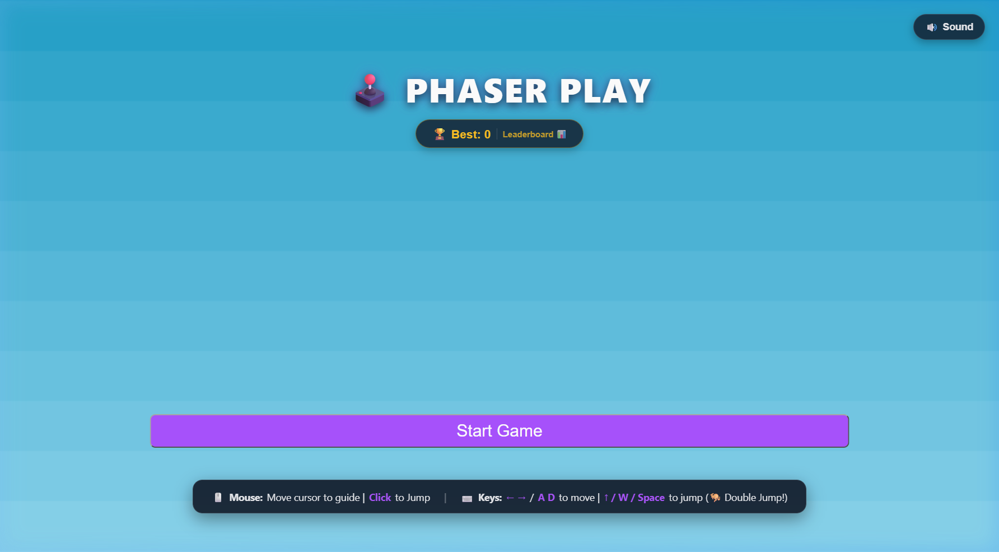
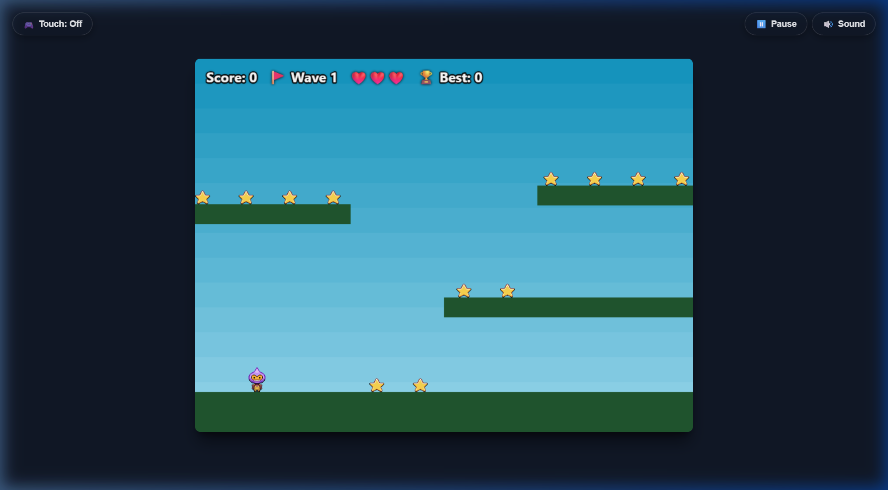

# PhaserPlay 🕹️

A modern, responsive retro 2D arcade platformer built with **React 19**, **Phaser 3**, and **Vite**.

## 🚀 Live Demo

🎮 **[Play PhaserPlay on Netlify](https://curious-meringue-0769c3.netlify.app/)**

---

## 🌟 Features

### 🎮 Multi-Input Controls
- **⌨️ Keyboard:** Arrow keys or **W / A / S / D** for movement, **Up / W / Space** for jump.
- **🖱️ Mouse:** Guide the player toward your mouse cursor with smooth deadzone stopping; **Left-Click** anywhere to jump.
- **📱 Mobile Touch D-Pad:** Dedicated on-screen directional buttons (`◀` / `▶`) and jump button (`▲`) for mobile and tablet players (with a toggle to show/hide on desktop).
- **🦘 Double Jump:** Tap Jump a second time in mid-air for an acrobatic double jump with visual sparkle badges.

### ❤️ Health & 3-Lives System
- **Arcade Heart Meter:** Real-time life HUD displaying current health (`❤️❤️❤️`).
- **Invulnerability & Knockback:** Taking a bomb hit triggers a physical knockback bounce and a 1.4-second flashing invulnerability period so you can safely reposition.
- **Floating Indicators:** Floating `-1 ❤️` and `+10` point popups for clear visual feedback.

### 🛡️ Power-Ups & Collectibles
- **Force Field Shield Bubble 🛡️:** Spawns on platforms every 2 waves. Collecting it surrounds the player with an animated pulsating force field that absorbs and deflects a bomb hit without losing any hearts.
- **Bonus Diamond 💎 (+50 Pts):** Rare high-value crystal gem that spawns upon wave completion.

### 🔥 Combo Streak Multiplier
- Collect stars in quick succession (under 2.5 seconds) to build up a **Combo Streak** (`2x`, `3x`, `4x`, `5x MEGA COMBO!`).
- Multiplies score points (`+10`, `+20`, `+30`, `+40`, `+50`) with ascending audio pitches and colorful floating badges.

### 🔊 Retro 8-Bit Web Audio Synthesizer
- Built with the native browser **Web Audio API** (zero external sound downloads, zero latency).
- Authentic synthesized SFX for jumping, coin chimes, explosion thumps, wave clear fanfare, shield power-ups, and game over tones.
- Persistent **Sound Mute / Unmute** toggle (`🔊 / 🔇`) saved in `localStorage`.

### 🚩 Wave Progression
- Clearing all 12 stars triggers the next wave (`Wave 2`, `Wave 3`...) with an animated banner and increasing difficulty (additional bombs and power-ups).

### ⏸️ Pause & Resume System
- Freeze game physics at any time by pressing **P**, **Esc**, or clicking the top-bar **Pause** button.
- Resume, restart, or return to the main menu without losing progress.

### 🏆 Top Runs Leaderboard & High Score Persistence
- View your **Top 5 Runs Leaderboard** directly from the Start Screen (`🏆 Best: X | Leaderboard 📊`).
- Records rank, score, wave reached, stars collected, and date of run in `localStorage`.

### 👾 Themed Game Over Modal
- Clean arcade modal featuring celebration badges for new high scores, complete stats breakdown, and quick restart with **Space** or **Enter**.

---

## 🕹️ Controls Cheat Sheet

| Action | Keyboard | Mouse | Mobile Touch |
| :--- | :--- | :--- | :--- |
| **Move Left** | `←` or `A` | Move cursor left of player | Press `◀` |
| **Move Right** | `→` or `D` | Move cursor right of player | Press `▶` |
| **Jump** | `↑` or `W` or `Space` | Left-Click anywhere | Tap `▲` |
| **Double Jump** | Press Jump again in air | Left-Click again in air | Tap `▲` again in air |
| **Pause Game** | `P` or `Escape` | Click `⏸️ Pause` button | Click `⏸️ Pause` button |
| **Quick Restart** | `Space` or `Enter` (on Game Over) | Click Play Again | Tap Play Again |

---

## 📁 Project Structure

```
PhaserPlay/
├── public/
│   ├── assets/              # Sprites, platforms, and backgrounds
│   └── _redirects           # Netlify SPA redirect rules
├── src/
│   ├── components/
│   │   ├── GameOverModal.jsx    # Game Over dialog & score summary
│   │   ├── LeaderboardModal.jsx # Top 5 High Scores leaderboard
│   │   ├── PauseModal.jsx       # Pause & resume overlay
│   │   ├── SoundToggle.jsx      # Audio mute/unmute toggle button
│   │   ├── StartScreen.jsx      # Start screen with title, badges, & chips
│   │   └── TouchControls.jsx    # Mobile virtual D-pad and jump button
│   ├── config/
│   │   ├── button-config.js     # Start button configuration
│   │   └── GameButton.jsx       # Reusable button component
│   ├── game/
│   │   └── GameScene.jsx        # Core Phaser 3 game loop & mechanics
│   ├── utils/
│   │   └── audio.js             # Web Audio API 8-bit retro sound synthesizer
│   ├── App.jsx                  # Main application shell
│   ├── main.jsx                 # React root entry point
│   └── index.css                # Global styles and viewport resets
├── index.html                   # HTML template with arcade canvas styles
├── netlify.toml                 # Netlify deploy configuration (publish = "dist")
├── package.json                 # Project dependencies & scripts
├── vite.config.js               # Vite build configuration
└── README.md                    # Project documentation
```

---

## 🛠️ Getting Started

### Prerequisites
- **Node.js** (v18 or higher recommended)
- **npm** or **yarn**

### Installation

1. Clone the repository:
   ```sh
   git clone https://github.com/AyshaUrmi0/PhaserPlay.git
   cd PhaserPlay
   ```

2. Install dependencies:
   ```sh
   npm install
   ```

3. Start the development server:
   ```sh
   npm run dev
   ```

4. Open your browser and navigate to `http://localhost:5173` (or the port specified by Vite).

---

## 🚀 Building & Deployment

To create an optimized production build:
```sh
npm run build
```

The production assets will be output to the **`dist/`** directory.

### Netlify Configuration
The repository includes a [netlify.toml](file:///d:/Projects/PhaserPlay/netlify.toml) configured with:
```toml
[build]
  command = "npm run build"
  publish = "dist"

[[redirects]]
  from = "/*"
  to = "/index.html"
  status = 200
```

---

## 📷 Screenshots

### Game Start Screen & Leaderboard


### In-Game Gameplay


---

## 📄 License
This project is open source and available under the [MIT License](LICENSE).

---

Made with ❤️ using **Phaser 3** and **React**.
